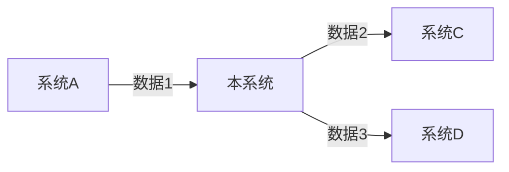

# 游戏系统设计文档（GDD）模板

基于行业标准GDD结构，适配AI辅助设计场景。

## 文档结构

```
# [系统名称] 设计文档

## 目录
1. Objectives（目标）
2. Overview（概述）
3. Mechanics（机制）
4. Data Flow（数据流）
5. UI（界面）
6. Edge Cases（边界条件）
7. Configuration（配置表）
8. Metrics & Analytics（指标与分析）
9. Technical Notes（技术说明）

---

## 1. Objectives（目标）

### 1.1 系统目标
- 核心问题：[这个系统要解决什么问题]
- 体验目标：[玩家应该感受到什么]
- 成功标准：[如何判断系统设计成功，需可度量]

### 1.2 约束条件
- 平台限制：[移动端/PC/主机，性能要求]
- 技术约束：[引擎限制、网络要求]
- 美术风格：[与整体美术风格的协调]
- 目标受众：[核心玩家群体特征]

### 1.3 系统边界
- 包含：[本系统负责的功能列表]
- 不包含：[明确排除的功能]

---

## 2. Overview（概述）

### 2.1 系统定位
- 在整个游戏中的位置：[核心系统/支撑系统/辅助系统]
- 与其他系统的关系：[依赖哪些系统，被哪些系统依赖]

### 2.2 核心机制
- 用一段话描述系统如何运作：[简洁的核心玩法描述]

### 2.3 玩家视角
- 玩家如何理解这个系统：[新手引导、学习曲线]
- 玩家如何使用这个系统：[主要交互入口、操作流程]

---

## 3. Mechanics（机制）

### 3.1 核心规则
- 规则1：[具体规则描述，包含触发条件、执行逻辑、结果]
- 规则2：[具体规则描述]
- ...

### 3.2 核心循环（四层嵌套）

#### 秒级操作（Core Action）
- 核心动作：[玩家最频繁的操作]
- 操作频率：[每秒/每几秒一次]
- 输入/输出：[输入什么状态，输出什么状态]

#### 分钟级活动（Activity）
- 活动定义：[由多个秒级操作组成的完整活动]
- 活动时长：[预计持续时间]
- 活动结构：[开始→过程→结束的完整流程]

#### 会话级目标（Session Goal）
- 目标定义：[一次游戏会话中玩家追求的目标]
- 目标类型：[收集/成长/探索/社交/成就]

#### 元循环（Meta Loop）
- 循环定义：[跨会话的长期目标循环]
- 进度类型：[角色成长/资源积累/内容解锁]

### 3.3 输入/输出矩阵
| 输入 | 处理逻辑 | 输出 |
|------|---------|------|
| [玩家操作/系统事件] | [处理规则] | [结果状态] |
| ... | ... | ... |

### 3.4 公式定义
- 公式1：[公式名称]
  - 公式：[数学表达式]
  - 变量说明：[每个变量的含义]
  - 取值范围：[每个变量的合理范围]
  - 设计意图：[为什么这样设计]

---

## 4. Data Flow（数据流）

### 4.1 数据来源
- 数据项1：来自[系统A]，触发条件[xxx]
- 数据项2：来自[系统B]，触发条件[xxx]

### 4.2 数据输出
- 数据项1：输出到[系统C]，用途[xxx]
- 数据项2：输出到[系统D]，用途[xxx]

### 4.3 数据流图
[用Mermaid语法绘制流程图，或文字描述数据流关系]



---

## 5. UI（界面）

### 5.1 界面布局
- 主界面：[描述界面元素和布局，包含功能分区]
- 子界面：[描述子界面和跳转逻辑]

### 5.2 交互流程
1. [步骤1]：[玩家操作] → [系统响应]
2. [步骤2]：[玩家操作] → [系统响应]
3. ...

### 5.3 信息展示
- 核心信息：[玩家最需要看到的信息]
- 次要信息：[辅助决策的信息]
- 隐藏信息：[需要主动查看的信息]

---

## 6. Edge Cases（边界条件）

### 6.1 数值边界
| 边界条件 | 处理方式 |
|---------|---------|
| [最大值/最小值] | [如何处理] |
| [溢出情况] | [如何处理] |

### 6.2 状态边界
| 边界条件 | 处理方式 |
|---------|---------|
| [异常状态] | [如何处理] |
| [并发操作] | [如何处理] |

### 6.3 时间边界
| 边界条件 | 处理方式 |
|---------|---------|
| [超时情况] | [如何处理] |
| [断线重连] | [如何处理] |

### 6.4 用户边界
| 边界条件 | 处理方式 |
|---------|---------|
| [非法输入] | [如何处理] |
| [重复操作] | [如何处理] |

---

## 7. Configuration（配置表）

### 7.1 配置表结构
| 字段名 | 类型 | 说明 | 示例值 | 取值范围 |
|-------|------|------|-------|---------|
| [字段1] | [int/float/string] | [说明] | [示例] | [范围] |
| [字段2] | [int/float/string] | [说明] | [示例] | [范围] |

### 7.2 可调参数
| 参数名 | 当前值 | 取值范围 | 说明 | 影响 |
|-------|-------|---------|------|------|
| [参数1] | [值] | [范围] | [说明] | [影响什么] |
| [参数2] | [值] | [范围] | [说明] | [影响什么] |

### 7.3 配置表示例
[提供3-5行示例数据，展示配置表的实际使用]

---

## 8. Metrics & Analytics（指标与分析）

### 8.1 核心指标
| 指标名称 | 定义 | 目标值 | 采集方式 |
|---------|------|-------|---------|
| [指标1] | [如何计算] | [目标数值] | [如何采集] |
| [指标2] | [如何计算] | [目标数值] | [如何采集] |

### 8.2 行为追踪
- 追踪点1：[玩家行为描述]，采集数据[xxx]
- 追踪点2：[玩家行为描述]，采集数据[xxx]

### 8.3 成功标准验证
- 标准1：[如何验证"系统目标"是否达成]
- 标准2：[如何验证"体验目标"是否达成]

---

## 9. Technical Notes（技术说明）

### 9.1 性能要求
- 帧率要求：[如移动端60FPS]
- 内存占用：[预估内存使用]
- 网络要求：[是否需要联网，延迟要求]

### 9.2 实现难点
- 难点1：[技术实现上的挑战]
- 难点2：[技术实现上的挑战]

### 9.3 依赖系统
- 系统1：[依赖什么功能，接口约定]
- 系统2：[依赖什么功能，接口约定]

### 9.4 扩展性考虑
- 未来可能的扩展方向：[xxx]
- 当前设计的局限性：[xxx]
```

## 使用说明

1. **步骤0初始化**：复制此模板到工作目录，命名为`[系统名称]_设计文档.md`
2. **步骤1-3填充**：在需求拆解、核心循环构建、系统拆解过程中逐步填充对应章节
3. **步骤4完善**：GDD撰写阶段完善所有细节
4. **步骤5验证**：逻辑验证阶段检查各章节的一致性和完整性

## AI辅助要点

- AI可以基于需求推测初版内容，但需明确标注"AI推测，需人类验证"
- 体感相关的部分（如核心动作是否好玩）必须由人类判断
- 公式设计需要AI提供数学推导，人类验证合理性
- 配置表参数需要AI提供取值范围建议，人类基于经验调整
